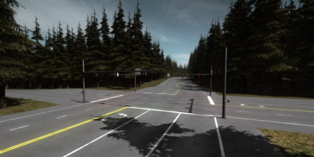
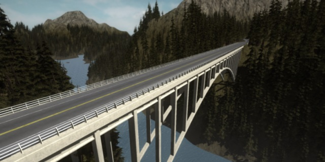
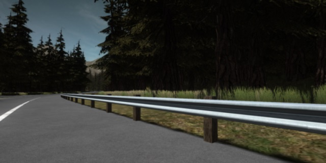
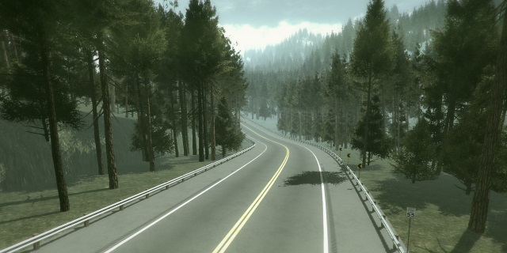

# RoadArchitect

Road Architect for Unity. Road architect is a professional quality road system creator featuring dynamic intersections, bridges and many other road objects.

Working with 5.5.0f3. If interested in contributing contact support@microgsd.com.

##
- The recommended way to install Road Architect is to use the unity package on the releases page. 
- https://github.com/MicroGSD/RoadArchitect/releases
- Documentation https://github.com/MicroGSD/RoadArchitect/wiki/Documentation
- Note: The Road Architect menu is located under the "Window" menu.

## Videos
- Overview: https://www.youtube.com/watch?v=AUwud3XklJ8
- 2.5 minutes: https://www.youtube.com/watch?v=DZWYfgDNSoo
- Road Architect Tutorial #1: Road Creation: http://youtu.be/IR4lwbnuPVQ
- Road Architect Tutorial #2: Bridges: http://youtu.be/Dq4c2Q0wlAs
- Road Architect Tutorial #3: Intersections: http://youtu.be/05Pg7U1FHyg
- Road Architect Tutorial #4: Extrusion & Edge Objects: http://youtu.be/jQT15NlWIV4
- Road Architect Tutorial #5: Splatmap Creation: http://youtu.be/qy71HXR4VBg
- Tutorial playlist: http://www.youtube.com/playlist?list=PLr4BO0oWm3C85qgyakKca4pGSAgZyS3nl

## Intersections

- Dynamic Procedurally generated based upon lanes, road width and angle of attack.
- Turn lanes Complete left and right optional turn lanes.
- Traffic lights Fully functioning and heavily detailed traffic light system including left on yield and right turn lane only lights.
- Assets Includes several assets such as traffic light poles, street lights, traffic lights, stop signs and more. Most include rigid body versions for dynamic environments.

## Bridges

- Bridge wizard Allows for instant creation of professional quality bridges such as causeway, arch, suspension and more. All bridge creation aspects are generated instantly allowing quick iteration.
- Customization Custom extrusion allows for mix and match of bridge parts. Over 50 bridge parts included.
- Details Many different types of railing, bases, center dividers included.
- Curvature Curvature of bridges supported including arch and suspension bridges.

## Railing and extrusions

- Railing 12+ Railing types included such as K-Rails and W Beams.
- Center dividers Many center divider options including the most popular configurations such as K-Rails with blinders or street lights. All aspects of mesh extrusion are performed instantly allowing quick iteration.
- Collision barriers Water barrels and other collision barriers come with prefabricated rigid or static body configurations.
- Custom extrusion Extrude any custom mesh along the spline with almost limitless customization.

## Assets

- Road assets several road assets included such as street lights, double lights, stop signs and more. All aspects of road asset placement are done instantly, allowing for quick iterations.
- Custom assets Place any custom mesh along the spline with an extreme amount of customization options.
- Signs 300+ U.S. federal and state road signs are pre-built and available for use.
- Future assets Assets will be added and freely available as time progresses.

## Quality

- Speed All mesh extrusion, bridge extrusion and road asset placement actions are instantaneous. Optimized road generation results in an average 100ms per (2km road + 1 intersection). Multithreaded support.
- Quality Most road textures at least 1024x1024 resolution. Most materials include normal and specular maps. Most assets created to federal or state specification.
